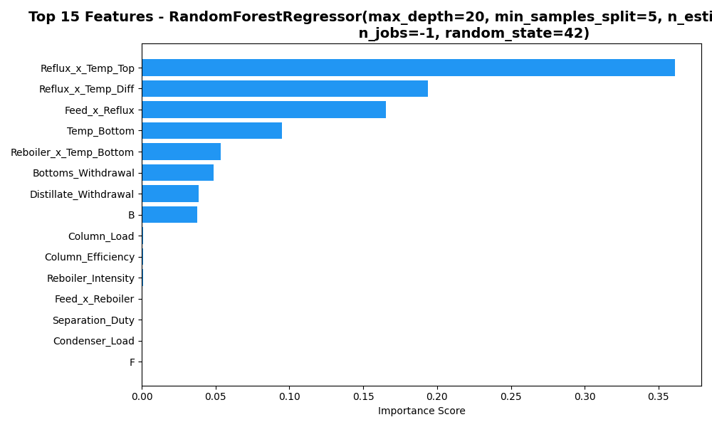
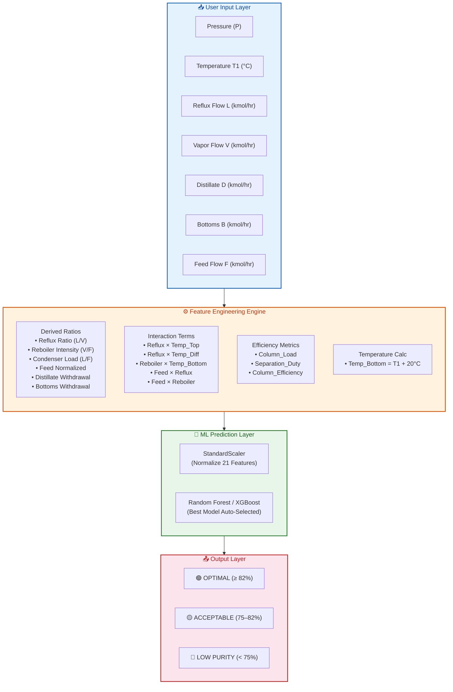

<div align="center">

# ⚗️ Distillation Column — Ethanol Purity Predictor

### Real-Time Machine Learning Estimation of Ethanol Purity in Distillation Columns

[](https://www.python.org/)
[](https://streamlit.io/)
[](https://scikit-learn.org/)
[](https://xgboost.readthedocs.io/)
[](LICENSE)

[](https://github.com/Mausam5055/Distillation-Column-Prediction/stargazers)
[](https://github.com/Mausam5055/Distillation-Column-Prediction/network/members)
[](https://github.com/Mausam5055/Distillation-Column-Prediction/issues)
[](https://github.com/Mausam5055/Distillation-Column-Prediction/commits/main)
[](https://github.com/Mausam5055/Distillation-Column-Prediction)

<br/>

> **A physics-informed machine learning system** that transforms 7 raw operating parameters into 21 engineered features — predicting ethanol purity with **R² > 0.98** accuracy.

<br/>



</div>

---

## 📑 Table of Contents

- [Overview](#-overview)
- [Key Features](#-key-features)
- [System Architecture](#-system-architecture)
- [ML Pipeline Flowchart](#-ml-pipeline-flowchart)
- [Feature Engineering](#-feature-engineering)
- [Model Performance](#-model-performance)
- [Quick Start](#-quick-start)
- [Project Structure](#-project-structure)
- [Input Parameters](#-input-parameters)
- [Output Interpretation](#-output-interpretation)
- [Usage Tips](#-usage-tips)
- [Model Training](#-model-training-colab)
- [Tech Stack](#-tech-stack)
- [Contributing](#-contributing)
- [License](#-license)
- [Contact](#-contact)

---

## 🔍 Overview

This application predicts **ethanol purity (mole fraction)** in distillation columns using ensemble machine learning models. It was trained on **4,000+ real distillation experiments** and validated with 5-fold cross-validation across diverse operating conditions.

The system accepts 7 readily-available operating parameters from DCS/SCADA systems and auto-calculates 14 additional physics-based features — delivering an instant purity estimate that engineers can trust for operational guidance.

| Aspect | Detail |
|:---|:---|
| **Domain** | Chemical Engineering — Distillation & Separation |
| **Task** | Regression — Predict Ethanol Mole Fraction |
| **Input** | 7 Core Operating Parameters |
| **Engineered Features** | 21 Total (7 raw + 14 derived) |
| **Models** | Random Forest & XGBoost (best model auto-selected) |
| **Accuracy** | R² > 0.98 · RMSE 0.0155 · MAE 0.0122 |
| **Interface** | Interactive Streamlit Web Dashboard |

---

## ✨ Key Features

| Feature | Description |
|:---|:---|
| ⚡ **Real-Time Prediction** | Instant ethanol purity estimation from live operating data |
| 🧪 **Physics-Informed** | Auto-calculates engineering ratios (Reflux Ratio, Reboiler Intensity) and temperature approximations |
| 📊 **Single Dashboard** | Consolidated metrics, predictions, and feature analysis in one view |
| 🎯 **High Accuracy** | R² > 0.98 with ±1.55% error margin |
| 🔍 **Explainable AI** | Feature Importance visualization shows *why* the model made each prediction |
| 🏭 **Industry-Ready** | Accepts parameters directly from DCS/SCADA systems |
| 🎨 **Color-Coded Status** | Instantly identifies OPTIMAL / ACCEPTABLE / LOW purity conditions |

---

## 🏗️ System Architecture



---

## 🔄 ML Pipeline Flowchart

```mermaid
flowchart LR
    A["📂 Raw Dataset\n4,000+ experiments"]
    B["🧹 Data Cleaning\n• Remove duplicates\n• Remove outliers (1-99%)"]
    C["⚙️ Feature Engineering\n• 21 total features\n• Physics-based ratios\n• Interaction terms"]
    D["⚖️ Dataset Balancing\n• Undersample middle range\n• Preserve edge cases"]
    E["✂️ Train/Val/Test Split\n60% / 20% / 20%"]
    F["📏 StandardScaler\nFit on train only"]
    G["🏋️ Model Training\n• XGBoost\n• Random Forest"]
    H["🔁 5-Fold\nCross-Validation"]
    I["🏆 Best Model\nSelection (R²)"]
    J["💾 Export Artifacts\nmodel.pkl\nscaler.pkl\nfeatures_names.pkl"]
    K["🚀 Streamlit App\nReal-time Prediction"]

    A --> B --> C --> D --> E --> F --> G --> H --> I --> J --> K

    style A fill:#E3F2FD,stroke:#1565C0,stroke-width:2px
    style B fill:#FFF9C4,stroke:#F57F17,stroke-width:2px
    style C fill:#FFF3E0,stroke:#E65100,stroke-width:2px
    style D fill:#F3E5F5,stroke:#7B1FA2,stroke-width:2px
    style E fill:#E0F7FA,stroke:#00838F,stroke-width:2px
    style F fill:#E8F5E9,stroke:#2E7D32,stroke-width:2px
    style G fill:#FFEBEE,stroke:#C62828,stroke-width:2px
    style H fill:#FFF3E0,stroke:#E65100,stroke-width:2px
    style I fill:#C8E6C9,stroke:#1B5E20,stroke-width:2px
    style J fill:#E1F5FE,stroke:#0277BD,stroke-width:2px
    style K fill:#FCE4EC,stroke:#AD1457,stroke-width:2px
```



---

## 🧬 Feature Engineering

The core innovation of this project lies in its **physics-informed feature engineering**. Instead of feeding raw sensor readings directly, the system constructs 21 meaningful features that capture the thermodynamics and mass-transfer physics of a distillation column.

### Feature Categories

| # | Feature Name | Category | Formula / Description |
|:---:|:---|:---:|:---|
| 1 | `Pressure` | 🔵 Core | Operating pressure (bar) |
| 2 | `L` | 🔵 Core | Reflux flow rate (kmol/hr) |
| 3 | `V` | 🔵 Core | Vapor flow rate (kmol/hr) |
| 4 | `D` | 🔵 Core | Distillate flow rate (kmol/hr) |
| 5 | `B` | 🔵 Core | Bottoms flow rate (kmol/hr) |
| 6 | `F` | 🔵 Core | Feed flow rate (kmol/hr) |
| 7 | `Temp_Bottom` | 🟠 Reference | T₁ + 20°C (reboiler approximation) |
| 8 | `Reflux_Ratio` | 🟢 Derived | L / V |
| 9 | `Reboiler_Intensity` | 🟢 Derived | V / F |
| 10 | `Condenser_Load` | 🟢 Derived | L / F |
| 11 | `Feed_Normalized` | 🟢 Derived | F / Mean(F_train) |
| 12 | `Distillate_Withdrawal` | 🟢 Derived | D / F |
| 13 | `Bottoms_Withdrawal` | 🟢 Derived | B / F |
| 14 | `Column_Load` | 🟣 Efficiency | (L + V) / F |
| 15 | `Reflux_x_Temp_Top` | 🔴 Interaction | Reflux_Ratio × T₁ |
| 16 | `Reflux_x_Temp_Diff` | 🔴 Interaction | Reflux_Ratio × (T_bottom − T_top) |
| 17 | `Reboiler_x_Temp_Bottom` | 🔴 Interaction | Reboiler_Intensity × T_bottom |
| 18 | `Feed_x_Reflux` | 🔴 Interaction | Feed_Normalized × Reflux_Ratio |
| 19 | `Feed_x_Reboiler` | 🔴 Interaction | Feed_Normalized × Reboiler_Intensity |
| 20 | `Separation_Duty` | 🟣 Efficiency | Reflux_Ratio × Reboiler_Intensity |
| 21 | `Column_Efficiency` | 🟣 Efficiency | Reflux_Ratio × Column_Load |

### Feature Category Summary

| Category | Count | Purpose |
|:---|:---:|:---|
| 🔵 Core Parameters | 6 | Direct sensor readings from DCS/SCADA |
| 🟠 Temperature Reference | 1 | Approximated reboiler temperature |
| 🟢 Derived Ratios | 6 | Normalized operating conditions |
| 🔴 Interaction Terms | 5 | Capture thermodynamic coupling effects |
| 🟣 Efficiency Metrics | 3 | Combined column performance indicators |

---

## 📈 Model Performance

### Model Comparison

| Metric | Random Forest | XGBoost | Winner |
|:---|:---:|:---:|:---:|
| **R² Score** | ~0.98 | ~0.97 | 🏆 Random Forest |
| **RMSE** | 0.0155 | 0.0178 | 🏆 Random Forest |
| **MAE** | 0.0122 | 0.0141 | 🏆 Random Forest |
| **5-Fold CV (Mean R²)** | ~0.97 | ~0.96 | 🏆 Random Forest |

### Model Specifications

| Property | Value |
|:---|:---|
| **Selected Model** | Random Forest Regressor |
| **Estimators** | 200 trees |
| **Max Depth** | 20 |
| **Min Samples Split** | 5 |
| **Training Samples** | ~1,200 (balanced) |
| **Original Dataset** | 4,000+ experiments |
| **Cross-Validation** | 5-Fold (shuffled) |
| **Scaling** | StandardScaler (fit on train only) |

### Validation Strategy

```
┌──────────────────────────────────────────────────────────────────┐
│                        Full Dataset (4,000+)                     │
├────────────────────┬──────────────────────────────────────────────┤
│  Cleaned & Balanced │  ~1,200 rows after outlier removal &       │
│                     │  undersampling of dominant middle range     │
├──────────┬─────────┴──────────┬───────────────────────────────────┤
│  Train   │    Validation      │            Test                   │
│  60%     │       20%          │            20%                    │
│          │                    │                                   │
│ Scaler   │  Hyperparameter    │   Final unbiased                  │
│ fitted   │  tuning & model    │   performance                     │
│ here     │  selection         │   evaluation                      │
└──────────┴────────────────────┴───────────────────────────────────┘
```

---

## 🚀 Quick Start

### Prerequisites

| Requirement | Version |
|:---|:---|
| Python | 3.8 or higher |
| pip | Latest recommended |
| Git | Any recent version |

### Installation

```bash
# 1. Clone the repository
git clone https://github.com/Mausam5055/Distillation-Column-Prediction.git
cd Distillation-Column-Prediction

# 2. Create a virtual environment (recommended)
python -m venv venv
source venv/bin/activate        # Linux/Mac
# venv\Scripts\activate         # Windows

# 3. Install dependencies
pip install -r requirements.txt

# 4. Launch the application
streamlit run app.py
```

The app will open automatically at **`http://localhost:8501`**

---

## 📁 Project Structure

```
Distillation-Column-Prediction/
│
├── 📄 README.md                    # Project documentation (this file)
├── 📄 LICENSE                      # MIT License
├── 📄 requirements.txt             # Python dependencies
├── 📄 .gitattributes               # Git LFS / attribute config
│
├── 🐍 app.py                      # Main Streamlit application (509 lines)
├── 🐍 model_training_script.py    # Full training pipeline (Colab-ready)
│
├── 🤖 model.pkl                   # Trained Random Forest model (~8 MB)
├── 📏 scaler.pkl                  # Fitted StandardScaler
├── 📋 features_names.pkl          # Ordered list of 21 feature names
├── 📊 feature_importance.png      # Feature importance bar chart
│
├── 📂 sample_data/
│   └── 📄 dataset_distill.csv     # Training dataset (~579 KB)
│
└── 📂 .devcontainer/
    └── 📄 devcontainer.json       # GitHub Codespaces configuration
```

### File Descriptions

| File | Size | Purpose |
|:---|:---:|:---|
| `app.py` | 17 KB | Streamlit web app — input UI, feature engineering, prediction display |
| `model_training_script.py` | 13 KB | End-to-end ML pipeline: cleaning → engineering → training → export |
| `model.pkl` | ~8 MB | Serialized best model (Random Forest with 200 estimators) |
| `scaler.pkl` | 1.3 KB | StandardScaler fitted on training data's 21 features |
| `features_names.pkl` | 329 B | Ordered list ensuring inference matches training feature order |
| `dataset_distill.csv` | 579 KB | Semicolon-delimited dataset with temperatures in Kelvin |

---

## 📥 Input Parameters

The app accepts **7 operating parameters** commonly available from process control systems:

| # | Parameter | Symbol | Unit | Range | Description |
|:---:|:---|:---:|:---:|:---:|:---|
| 1 | **Pressure** | P | bar | 0.5 – 3.0 | Column operating pressure |
| 2 | **Top Temperature** | T₁ | °C | 60 – 120 | Temperature at the top tray sensor |
| 3 | **Reflux Flow** | L | kmol/hr | 300 – 1,200 | Liquid returned from the condenser |
| 4 | **Vapor Flow** | V | kmol/hr | 600 – 1,500 | Vapor rising from the reboiler |
| 5 | **Distillate Flow** | D | kmol/hr | 100 – 500 | Top product withdrawal rate |
| 6 | **Bottoms Flow** | B | kmol/hr | 100 – 500 | Bottom product withdrawal rate |
| 7 | **Feed Flow** | F | kmol/hr | 350 – 700 | Raw material feed rate |

### Typical Operating Ranges

| Parameter | Normal | ⚠️ Critical High | ⚠️ Critical Low |
|:---|:---:|:---:|:---:|
| Top Temp (T₁) | 77 – 80 °C | > 85 °C *(water in product)* | < 75 °C *(subcooled)* |
| Reflux Ratio (L/V) | 1.2 – 2.5 | > 3.0 *(flooding risk)* | < 0.6 *(poor separation)* |
| Reboiler Vapor (V) | 900 – 1,100 | > 1,200 | < 800 |
| Mass Balance (D+B) | ≈ F | D+B >> F | D+B << F |

---

## 📤 Output Interpretation

### Purity Status Levels

| Status | Purity Range | Color | Recommended Action |
|:---|:---:|:---:|:---|
| 🟢 **OPTIMAL** | ≥ 82% | Green | Maintain current settings |
| 🟡 **ACCEPTABLE** | 75% – 82% | Yellow | Monitor — consider increasing reflux |
| 🔴 **LOW PURITY** | < 75% | Red | Immediate attention — check reflux, temperature, and feed rate |

### Typical Prediction Ranges

| Purity Range | Operating Condition | Likely Cause |
|:---|:---|:---|
| 0.92 – 0.98 | Excellent separation | High reflux ratio, optimal temperatures |
| 0.85 – 0.92 | Normal operation | Standard reflux, good conditions |
| 0.75 – 0.85 | Acceptable | Standard operation, moderate reflux |
| < 0.75 | Poor separation | Low reflux, high top temperature, column overload |

---

## 💡 Usage Tips

### Best Practices

| Tip | Explanation |
|:---|:---|
| ✅ Use **steady-state** data | Transient readings during startup/shutdown will give unreliable predictions |
| ✅ Maintain **mass balance** | Ensure D + B ≈ F — large imbalances indicate sensor errors |
| ✅ Stay within **operating ranges** | Extrapolation beyond training ranges decreases reliability |
| ✅ Keep **T₁ sensor calibrated** | Top temperature is a critical driver of prediction accuracy |
| ✅ Prefer **higher reflux ratios** | Higher reflux generally yields higher predicted purity |

### Troubleshooting

| Problem | Possible Cause | Fix |
|:---|:---|:---|
| Purity < 0.70 | Reflux Ratio too low | Increase reflux flow (L) |
| Purity < 0.70 | Top Temp > 82°C | Reduce reboiler steam (V) — water is boiling into the product |
| Purity < 0.70 | Feed > 620 kmol/hr | Column may be overloaded — reduce feed rate |
| Model file error | Missing `.pkl` files | Ensure `model.pkl`, `scaler.pkl`, `features_names.pkl` are in the root directory |
| Inconsistent results | Sensor drift | Recalibrate T₁ temperature sensor |

---

## 🎓 Model Training (Colab)

The training pipeline is contained in `model_training_script.py` and is designed to run on **Google Colab**.

### Training Steps

| Step | Description | Key Details |
|:---:|:---|:---|
| 1 | **Load Data** | Read `dataset_distill.csv` (semicolon-delimited) |
| 2 | **Unit Conversion** | Convert temperatures T1–T14 from Kelvin → Celsius |
| 3 | **Data Cleaning** | Remove duplicates, nulls, and outliers (1st–99th percentile) |
| 4 | **Feature Engineering** | Create 21 features from 6 core parameters + temperature |
| 5 | **Dataset Balancing** | Undersample dominant middle purity range (40%) |
| 6 | **Train/Val/Test Split** | 60% train · 20% validation · 20% test |
| 7 | **Scaling** | StandardScaler fit on training data only |
| 8 | **Model Training** | Train XGBoost (500 trees) and Random Forest (200 trees) |
| 9 | **Cross-Validation** | 5-Fold CV on training set for both models |
| 10 | **Model Selection** | Auto-select the model with the highest test R² |
| 11 | **Residual Analysis** | Predicted vs Actual, Q-Q Plot, Homoscedasticity check |
| 12 | **Export Artifacts** | Save `model.pkl`, `scaler.pkl`, `features_names.pkl` |

### Model Hyperparameters

<details>
<summary><b>🌲 Random Forest Configuration</b></summary>

| Parameter | Value |
|:---|:---|
| `n_estimators` | 200 |
| `max_depth` | 20 |
| `min_samples_split` | 5 |
| `random_state` | 42 |
| `n_jobs` | -1 (all cores) |

</details>

<details>
<summary><b>⚡ XGBoost Configuration</b></summary>

| Parameter | Value |
|:---|:---|
| `n_estimators` | 500 |
| `max_depth` | 6 |
| `learning_rate` | 0.03 |
| `subsample` | 0.85 |
| `colsample_bytree` | 0.85 |
| `reg_alpha` | 0.1 |
| `reg_lambda` | 1.0 |
| `random_state` | 42 |

</details>

---

## 🛠️ Tech Stack

| Category | Technology | Purpose |
|:---|:---|:---|
| **Language** | Python 3.8+ | Core programming language |
| **Web Framework** | Streamlit | Interactive dashboard UI |
| **ML Libraries** | scikit-learn, XGBoost | Model training & inference |
| **Data Processing** | pandas, NumPy | Data manipulation & computation |
| **Visualization** | Matplotlib, Seaborn | Feature importance & residual plots |
| **Image Processing** | Pillow (PIL) | Display feature importance chart |
| **Serialization** | pickle | Model & scaler persistence |
| **Development** | Google Colab | Training environment |
| **Deployment** | GitHub Codespaces | Cloud development via devcontainer |

---

## 🤝 Contributing

Contributions are welcome! Here's how you can help:

1. **🍴 Fork** the repository
2. **🌿 Create** a feature branch (`git checkout -b feature/amazing-feature`)
3. **💾 Commit** your changes (`git commit -m 'Add amazing feature'`)
4. **📤 Push** to the branch (`git push origin feature/amazing-feature`)
5. **🔀 Open** a Pull Request

### Contribution Ideas

| Area | Suggestion |
|:---|:---|
| 🧪 Data | Add more distillation experiments or real plant data |
| 🤖 Models | Try neural networks, gradient boosting variants, or ensemble stacking |
| 🎨 UI | Add trend charts, historical predictions, or batch upload |
| 📊 Analysis | Add SHAP values for per-prediction explainability |
| 🚀 Deployment | Add Docker support or cloud deployment (AWS/GCP/Azure) |

---

## 📝 License

This project is licensed under the **MIT License** — see the [LICENSE](LICENSE) file for details.

```
MIT License · Copyright (c) 2026 Krishna Narayan Singh
```

---

## 📞 Contact

| Channel | Link |
|:---|:---|
| 📧 **Email** | [krishnanarayansingh65@gmail.com](mailto:krishnanarayansingh65@gmail.com) |
| 💼 **LinkedIn** | [Krishna Narayan Singh](https://www.linkedin.com/in/krishnansingh) |
| 🐙 **GitHub (Author)** | [KrishnaNsingh](https://github.com/KrishnaNsingh) |
| 🐙 **GitHub (Contributor)** | [Mausam5055](https://github.com/Mausam5055) |

---

<div align="center">

**Built with ❤️ for Chemical Engineering & Machine Learning**

**Author:** Krishna Narayan Singh · **Last Updated:** April 2026 · **Version:** 1.0

[](https://github.com/Mausam5055/Distillation-Column-Prediction)

</div>
